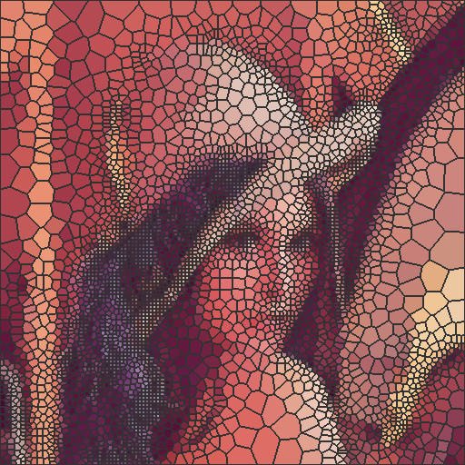

# python-mosaic

## Introduction

This project implementing approach which comes from an IEEE paper, **Simple Adaptive Mosaic Effects**, makes users be able to add mosaic effect to images  

## Prerequisite

Make sure  **python3** has been installed and that will be used in this project, **python2 is not working**

And install necessary libraries

```
$ pip3 install --user -r requirements.txt
```

If you wanna use GUI then make sure qt5
libraries has been installed

## Usage

You can use command-line or gui to use thess programs. command-line way is suggested because of more arguments offered to tune

### Use command-line

First step, generate seeds from raw image

```
$ python3 seedgen.py <image-file>
```

You will get a pickle file (default : seed.pickle) containing seeds data when this process completes

Also, you can  tune parameters like minimal area in pixels and error rate, or output the seed distribution to check. Type `--help` to see more information

Second step, use voronoi diagram generator to create a voronoi diagram and dump as a file

```
$ python3 voronoigen.py -input <seed-file> -t <iteration time>
```

The last step, use mosaic-ploting program to put color
on 

```
$ python3 mosaicplot.py -input <vor-dig-file> [ -pa | -pc ] [ -pme ] -o <output-file>
```

#### Example

```
$ python3 seedgen.py sample.jpg
$ python3 voronoigen.py
$ python3 mosaicplot.py -pc -pme
```

### Use GUI

This project supports GUI by Qt5. Make sure that you have Qt5 libraries installed
before using 

```
$ python3 gui-qt5.py
```

to open GUI

### Optimization

If your operation system is Linux, You have a chance to benefit from the
speedup of parallelism

To acheive that, you need to compile
some files. A script is given for you to compile conveniently 

```
sh compile.sh
```

## Demo




## Reference

- [Simple Adaptive Mosaic Effects](http://ieeexplore.ieee.org/document/1599119/)

## License

GNU General Public License v3.0